# edible — Project Knowledge Base

> **Purpose:** Single-source summary of all planning documents in `docs/`.  
> **Status:** Draft (pre-implementation phase)  
> **Generated:** 2026-07-14

---

## 1. Product Vision

**edible** is an AI-powered food safety and personalized nutrition platform. It answers: *"Is this meal safe for me?"*

**Problem:** Generic nutrition apps ignore individual health conditions (diabetes, hypertension, kidney disease, allergies). Calorie counting alone does not tell a user whether a meal is *personally* suitable.

### Target Personas

| Persona | Needs |
|---------|-------|
| Chronic condition patient | Daily meal safety checks |
| Health-conscious adult | Proactive, condition-aware nutrition |
| Caregiver | Log meals for dependents with dietary restrictions |

### Core Features

- Health profile management (conditions, allergies, goals)
- Multi-modal food input: photo, image upload, manual text
- AI-powered ingredient recognition and nutrition estimation
- Condition-specific recommendation engine
- Extensible disease/rule support (add new conditions without code changes)

### Out of Scope (initial release)

- Medical diagnosis, prescriptions, medication management, social features, meal sharing

---

## 2. System Architecture

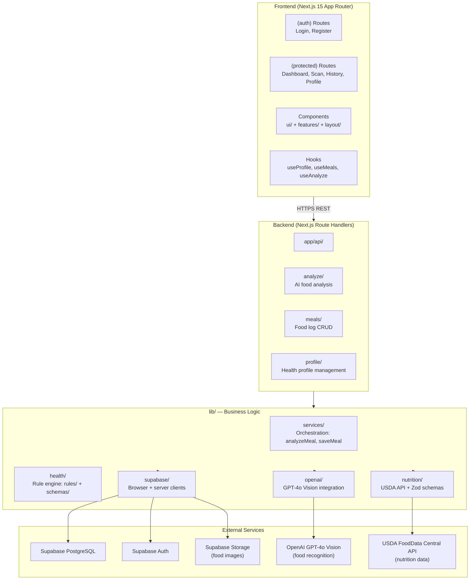

### Component Boundaries

| Component | Responsibility | Location |
|-----------|---------------|----------|
| Frontend | UI, user input, result display | `app/`, `components/`, `hooks/` |
| Backend API | Auth, profiles, logs, rule orchestration | `app/api/` |
| AI Service | Stateless food recognition + nutrition estimation | `lib/openai/` |
| Database | Persistent structured storage | Supabase PostgreSQL |
| Rule Engine | Condition-specific recommendation logic | `lib/health/rules/` |

### Communication Patterns

- Frontend ↔ Backend: HTTPS REST (JSON)
- Backend ↔ AI: Internal HTTP (GPT-4o Vision via OpenAI SDK)
- Backend ↔ USDA: HTTP (USDA FoodData Central API)
- Backend ↔ Database: Supabase client SDK

---

## 3. Core Data Flow: Food Analysis

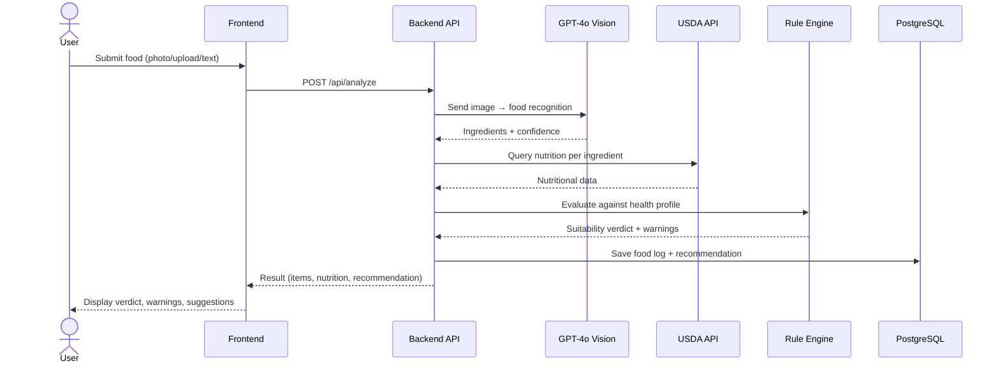

---

## 4. Design Decisions

| Decision | Choice | Rationale |
|----------|--------|-----------|
| Recommendation logic | Rule-based engine | Add conditions without ML retraining; deterministic, explainable |
| AI role | Ingredient + nutrition estimation only | AI informs; rules decide suitability — clear separation of concerns |
| Food input | Multi-modal with fallback | Manual entry when AI confidence is low; no dead ends |
| Data storage | PostgreSQL (relational) | Structured health profiles, audit trails, ACID compliance |
| Rule parameters | JSONB columns | Flexible thresholds per condition (e.g., max carbs for diabetes), extensible without schema changes |
| Architecture | Next.js monolith (single app) | Single Node.js process; simpler local dev and deployment |
| Auth | Supabase Auth (JWT) | Integrated with Supabase stack; email + Google OAuth |
| Deployment | Vercel + Supabase | Zero-config for Next.js; managed DB without ops overhead |

### Extensibility Model (Adding a New Condition)

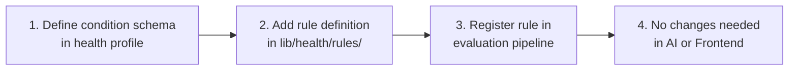

---

## 5. Database Schema

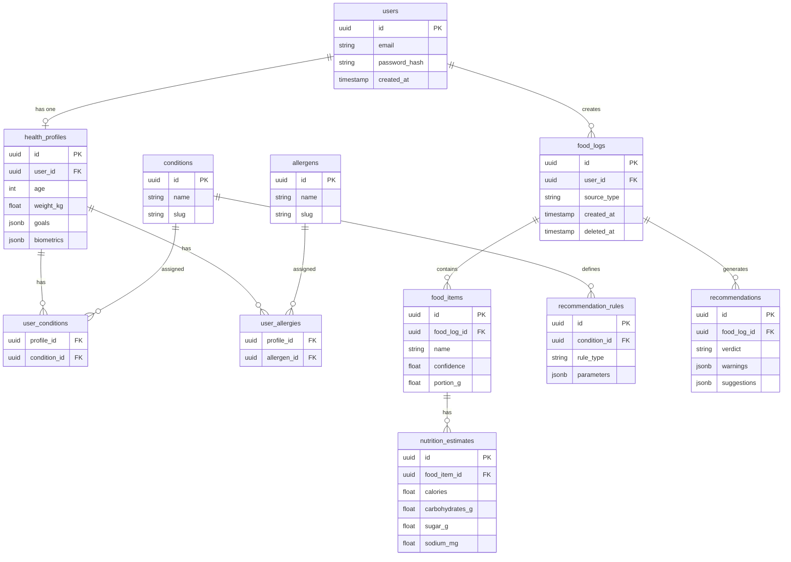

### Indexing Strategy

| Index | Purpose |
|-------|---------|
| `food_logs(user_id, created_at DESC)` | Meal history queries |
| `user_conditions(profile_id)` | Fast rule lookup |
| `recommendation_rules(condition_id)` | Rule engine reads |

### Privacy & Security

- Health profiles contain PHI-adjacent data — encryption at rest
- Row-level security tied to authenticated user
- Soft deletes on food logs (audit trail + recovery)
- Data export and deletion endpoints planned

---

## 6. AI Pipeline

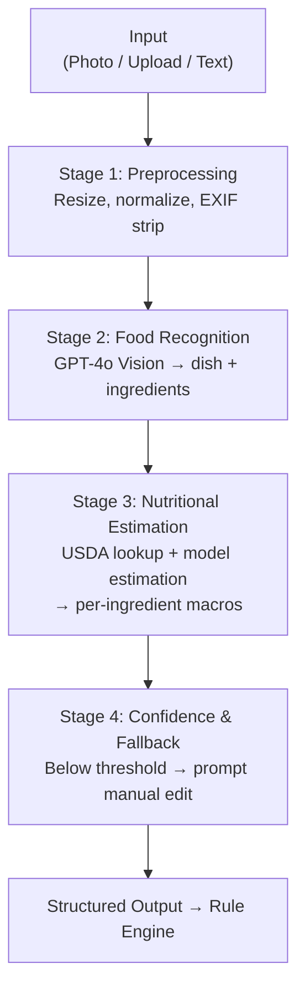

### Input Modes

| Mode | Pipeline Entry | Notes |
|------|---------------|-------|
| Photo (camera) | Image → GPT-4o Vision | Real-time |
| Image upload | Image → GPT-4o Vision | Same pipeline |
| Manual entry | Text → NLP parser | Extract ingredients from free text |

### Output Schema

```json
{
  "items": [
    {
      "name": "white rice",
      "confidence": 0.92,
      "portion_g": 150,
      "nutrition": {
        "calories": 195,
        "carbohydrates_g": 42,
        "sugar_g": 0.1,
        "sodium_mg": 1
      }
    }
  ],
  "aggregate": { "..." },
  "overall_confidence": 0.88
}
```

### Key Principle

AI output is **input** to the recommendation engine — not the final answer. The AI service is stateless and has no user profile access. The backend receives structured nutrition data and applies condition-specific rules.

### Model Strategy (TBD)

| Task | Approach Options |
|------|-----------------|
| Food recognition | GPT-4o Vision (multimodal LLM) |
| Portion estimation | Reference object scaling / model regression |
| Nutrition lookup | USDA FoodData Central API + model estimation for gaps |
| Text parsing | LLM-based ingredient extraction |

### Monitoring

- Food recognition accuracy (benchmark dataset)
- Nutrition estimation error (MAE vs labeled data)
- Production: latency, confidence distribution, fallback rate

---

## 7. API Summary

### Conventions

- Base URL: `https://api.edible.app/v1`
- Authentication: Bearer token (JWT via Supabase Auth)
- Content-Type: `application/json`
- Error format: `{ "error": { "code": "...", "message": "..." } }`

### Endpoints

| Method | Path | Description | Auth |
|--------|------|-------------|------|
| `POST` | `/auth/register` | Create account | No |
| `POST` | `/auth/login` | Obtain access token | No |
| `POST` | `/auth/refresh` | Refresh access token | Yes |
| `POST` | `/auth/logout` | Invalidate session | Yes |
| `GET` | `/profiles/me` | Get health profile | Yes |
| `PUT` | `/profiles/me` | Create/update health profile | Yes |
| `GET` | `/profiles/me/conditions` | List supported conditions | Yes |
| `POST` | `/food-logs` | Create food log (manual) | Yes |
| `POST` | `/food-logs/analyze` | Submit image for AI analysis | Yes |
| `GET` | `/food-logs` | List food logs | Yes |
| `GET` | `/food-logs/:id` | Get log with recommendation | Yes |
| `DELETE` | `/food-logs/:id` | Delete food log | Yes |
| `GET` | `/food-logs/:id/recommendation` | Get recommendation | Yes |
| `POST` | `/food-logs/:id/feedback` | User feedback | Yes |

### Core Schemas

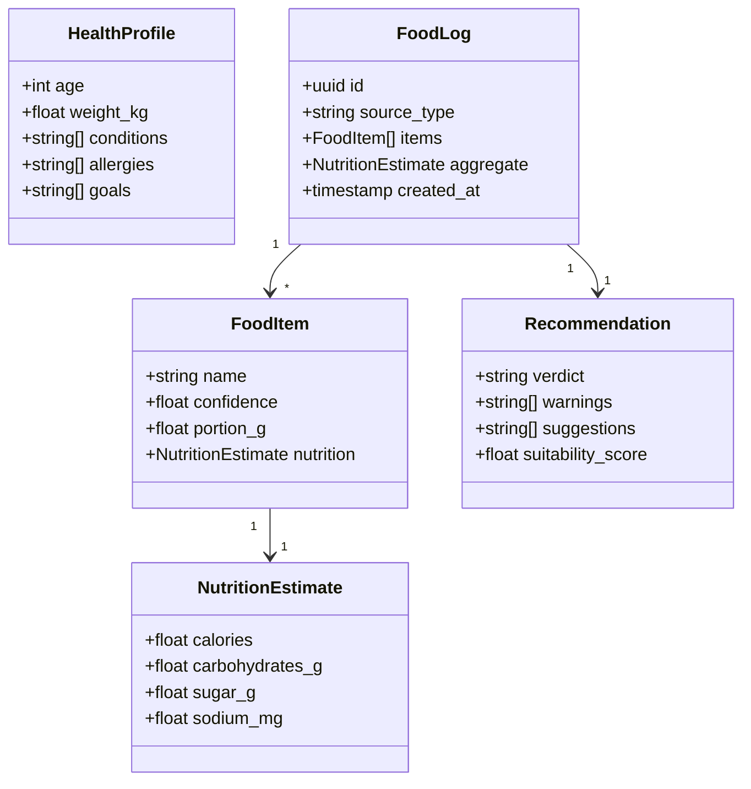

### Error Codes

| Code | HTTP Status | Description |
|------|-------------|-------------|
| `UNAUTHORIZED` | 401 | Missing or invalid token |
| `PROFILE_REQUIRED` | 422 | Health profile not set |
| `ANALYSIS_FAILED` | 502 | AI pipeline error |
| `UNSUPPORTED_CONDITION` | 400 | Unknown health condition |

---

## 8. User Flows

### Journey 1: Onboarding & Profile Setup

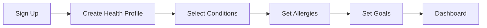

First-time users must complete profile before food analysis. Profile is editable at any time; changes apply to future analyses.

### Journey 2: Photo-Based Food Analysis (Primary Flow)

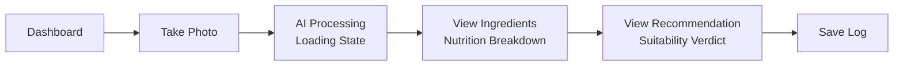

### Journey 3: Image Upload Analysis

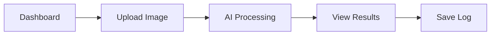

### Journey 4: Manual Food Entry

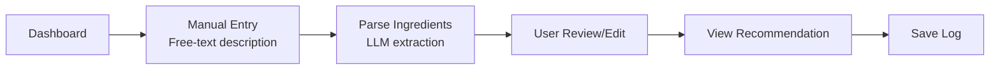

### Journey 5: Review Meal History

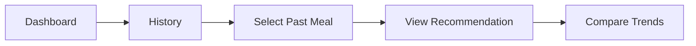

### Recommendation Display

Users see:
- **Suitability verdict** — Suitable / Caution / Not Recommended
- **Condition-specific warnings** — e.g., *"High carbohydrates — may affect blood sugar"*
- **Actionable suggestions** — e.g., *"Consider reducing portion or pairing with protein"*
- **Confidence indicator** — when AI is uncertain

### Edge Cases

| Scenario | Behavior |
|----------|----------|
| No profile set | Redirect to profile setup |
| AI low confidence | Prompt to confirm/edit manually |
| AI failure | Graceful fallback to manual entry |
| Unsupported condition | Inform user; generic nutrition shown |
| Allergen detected | Prominent warning before user proceeds |

---

## 9. Deployment

### Environments

| Environment | Purpose |
|-------------|---------|
| **Local** | Docker Compose — all services on localhost |
| **Development** | Shared dev environment |
| **Staging** | Pre-production validation, auto-deployed from `main` |
| **Production** | Live, deployed on tagged releases |

### CI/CD Pipeline

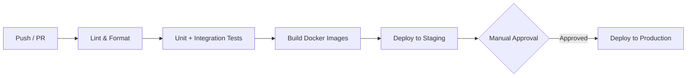

| Stage | Tool | Scope |
|-------|------|-------|
| Lint & Format | GitHub Actions | All packages |
| Unit Tests | GitHub Actions | Backend, frontend, AI |
| Integration Tests | GitHub Actions | API + database |
| Build | Docker | All services |
| Deploy | GitHub Actions + Vercel | Staging → Production |

### Release Process

1. Feature branches merged to `main` via PR (squash merge)
2. `main` auto-deploys to staging
3. Tagged releases (`vX.Y.Z`) trigger production deployment
4. Changelog generated from conventional commits

### Infrastructure

- **Hosting:** Vercel (Next.js frontend + API routes)
- **Database:** Supabase managed PostgreSQL
- **Storage:** Supabase Storage (food images)
- **AI:** OpenAI API (GPT-4o Vision)
- **Cache:** Vercel Edge / Supabase

### Monitoring

- Structured JSON logging, centralized
- Metrics: request latency, AI inference time, error rates
- Alerts: API downtime, AI pipeline failures, DB connection issues
- Health checks: `/health` on all services

### Secrets Management

- Environment variables via Vercel / Supabase secret manager
- No secrets in repository or Docker images
- Rotation policy for API keys and DB credentials

### Rollback

- Database migrations must be backward-compatible
- One-command rollback to previous deployment/image tag

---

## 10. Contributing

### Branch Naming

| Prefix | Use |
|--------|-----|
| `feature/` | New functionality |
| `fix/` | Bug fixes |
| `docs/` | Documentation only |
| `refactor/` | Code restructuring |
| `chore/` | Tooling, CI, dependencies |

### Commit Convention

Follow [Conventional Commits](https://www.conventionalcommits.org/):
```
feat(backend): add health profile endpoint
fix(ai): handle low-confidence food recognition
docs: update API.md with recommendation schema
```

### PR Guidelines

- One concern per PR, small and focused
- Clear *what* and *why* in description
- Link related issues
- Update docs if behavior changes
- CI must pass before review
- At least one approval required before merge
- Squash merge to `main`

### Code Standards

- Linting and formatting enforced via CI
- No secrets or credentials in code
- Health recommendation logic must have unit tests
- API changes require updates to `docs/API.md`

### Documentation Map

| When you change... | Update... |
|--------------------|-----------|
| Product scope/features | `docs/PRODUCT.md` |
| Architecture/design | `docs/ARCHITECTURE.md`, `docs/SYSTEM_DESIGN.md` |
| New endpoints | `docs/API.md` |
| Schema changes | `docs/DATABASE.md` + add migration |
| AI pipeline | `docs/AI_PIPELINE.md` |
| Release process | `docs/DEPLOYMENT.md` |

---

## 11. Tech Stack Summary

| Layer | Technology | Version |
|-------|-----------|---------|
| Framework | Next.js (App Router) | 15 |
| UI Library | React | 19 |
| Language | TypeScript | — |
| Styling | Tailwind CSS | — |
| Components | shadcn/ui | — |
| Auth | Supabase Auth (JWT) | — |
| Database | Supabase PostgreSQL | — |
| Storage | Supabase Storage | — |
| AI | OpenAI GPT-4o Vision | — |
| Nutrition | USDA FoodData Central API | — |
| Validation | Zod | — |
| Server State | TanStack Query | — |
| Forms | React Hook Form | — |
| Charts | Recharts | — |
| Package Manager | pnpm | — |
| Deployment | Vercel + Supabase | — |
| CI/CD | GitHub Actions | — |

---

## 12. Document Status

All documents in `docs/` are **Draft** — the project is in pre-implementation foundation phase. Directory scaffold is complete; no source code, `package.json`, or config files exist yet.

### Source Documents

| Document | Theme |
|----------|-------|
| [PRODUCT.md](../docs/PRODUCT.md) | Product vision, personas, features |
| [ARCHITECTURE.md](../docs/ARCHITECTURE.md) | System components, data flow |
| [SYSTEM_DESIGN.md](../docs/SYSTEM_DESIGN.md) | Design rationale, trade-offs |
| [API.md](../docs/API.md) | API contract, endpoints, schemas |
| [DATABASE.md](../docs/DATABASE.md) | Data model, entities, migrations |
| [AI_PIPELINE.md](../docs/AI_PIPELINE.md) | Food recognition & nutrition estimation |
| [USER_FLOW.md](../docs/USER_FLOW.md) | User journeys & interaction patterns |
| [DEPLOYMENT.md](../docs/DEPLOYMENT.md) | Environments, CI/CD, operations |
| [CONTRIBUTING.md](../docs/CONTRIBUTING.md) | Contribution guidelines & standards |
